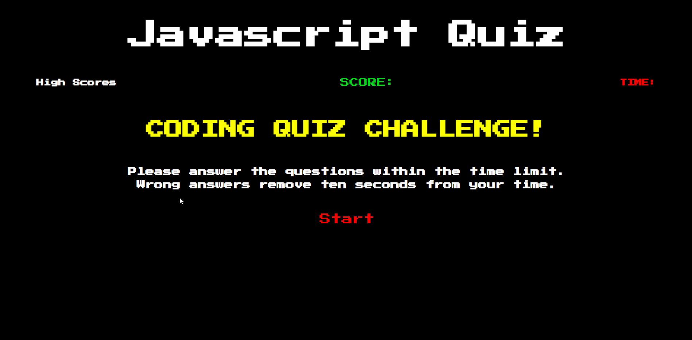

# Javascript Quiz

## Description

This is a timed quiz in made using javascript, css, and html.

## Installation

The application works through opening the index.html file in an internet browser.

## Usage Information

Open the website to use the application. Answer the question and your time left is visibly calculated and score displayed. When you submit a score then the high scores are saved to localstorage.

## Contribution Guidelines

This is a completed project and no contributions are needed.

## User Story

WHEN I click the start button
THEN a timer starts and I am presented with a question ✔️

WHEN I answer a question
THEN I am presented with another question ✔️

WHEN I answer a question incorrectly
THEN time is subtracted from the clock ✔️

WHEN all questions are answered or the timer reaches 0
THEN the game is over ✔️

WHEN the game is over
THEN I can save my initials and score ✔️

